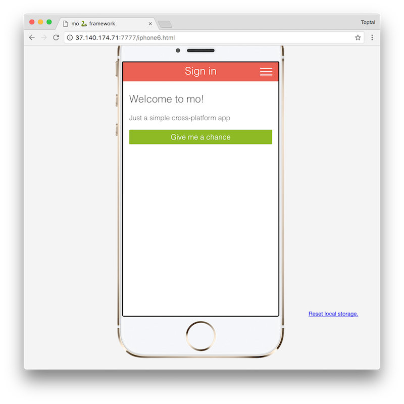
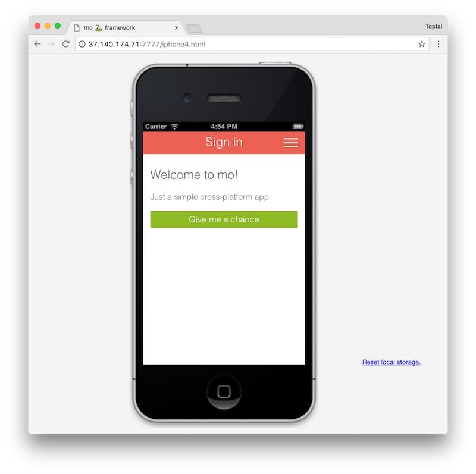
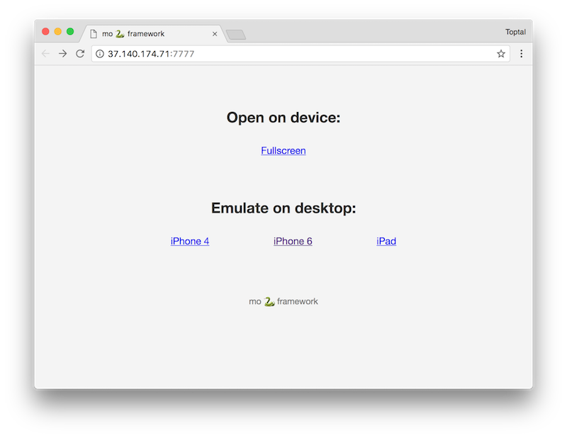
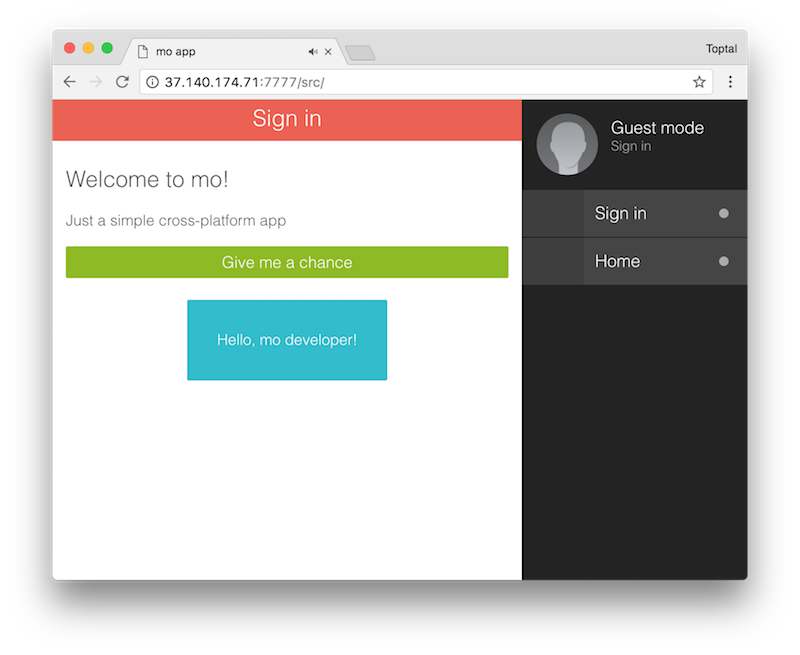

## mo 🐍 framework

**Hybrid mobile and web app framework with generators**

Create awesome mobile and web apps:
* Using all **ES6+** features
* With any **view engine** you love
* Generating **scaffold** stuff
* With **wireless hot-reload** on devices

### Fast start
```bash
# Install mo globally
npm install -g mo-framework
# Create new app
mo new my-app && cd my-app
# Install dependencies
npm install
# Start the development server
mo serve
```
Now open http://x.x.x.x:7777 in your mobile or desktop browser. 

*Add the page to your device Home Screen to run it in fullscreen.*

### Using generators
```bash
# Create new page with .js, .hbs and .less files
mo generate page Profile

# Create new modal with .js, .hbs and .less files
mo generate modal Connection
```
Now edit `views/components/menu/menu.hbs` to include new page to menu.

### Using with PhoneGap
```bash
# Setup
cd phonegap/
phonegap platform add ios
phonegap platform add android
cd ../

# Run/emulate
npm run phonegap
```

### Publishing as web app
```bash
npm run webapp
```
Tune `webapp/index.html` if needed and upload `webapp` folder to your web hosting.

### Demo screenshots




